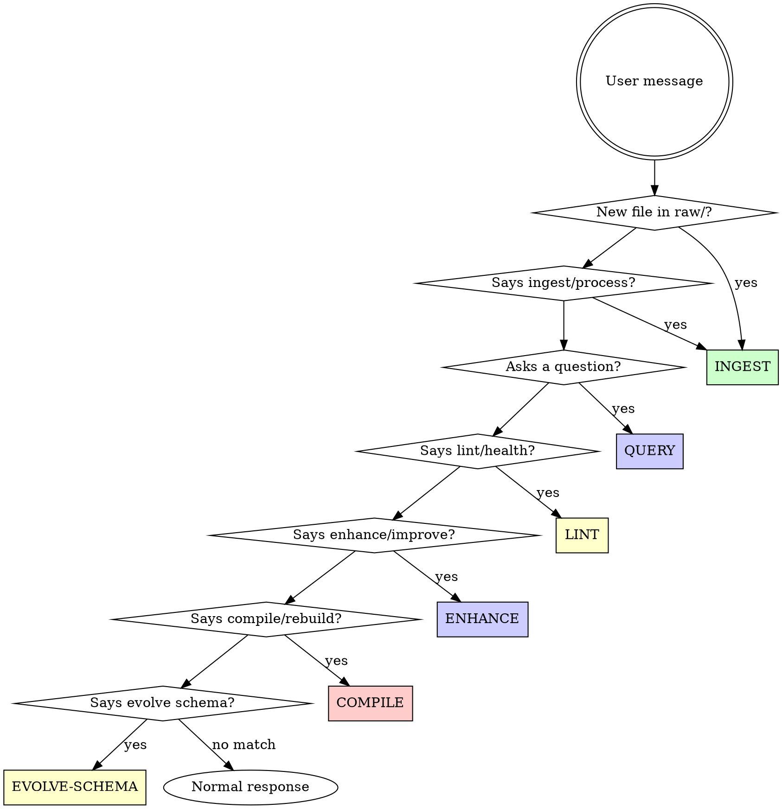
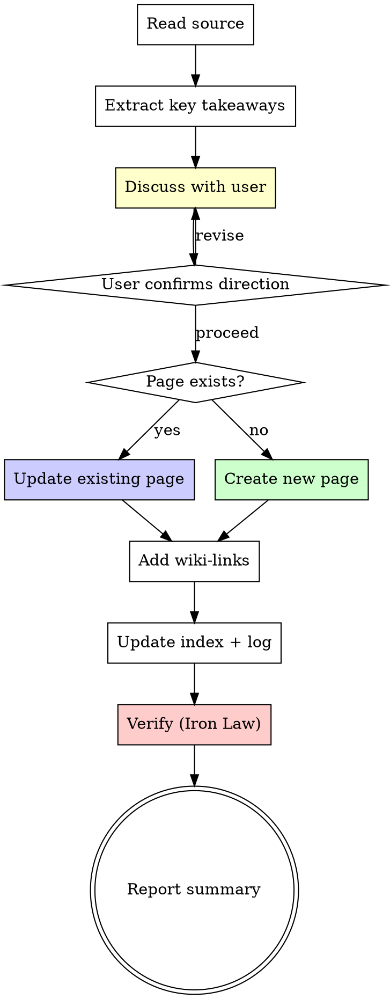

# LLM Wiki — Knowledge Compilation Skill

> Based on Andrej Karpathy's LLM Wiki pattern (April 2026).
> The correct way to use LLMs is not Q&A — it's **compilation**.

## Overview

This skill turns a coding agent into a disciplined wiki maintainer. Instead of
rediscovering knowledge from scratch on every question (RAG), the agent
**compiles** raw sources into a persistent, interlinked Markdown wiki that
compounds over time.

The agent owns the wiki layer. The human owns the raw sources and the schema.
The human reads; the agent writes.

<HARD-GATE>
Do NOT create or update any wiki page without: (1) YAML frontmatter with all
required fields, (2) at least one raw/ source citation, (3) at least two
[[wiki-links]] to related pages, (4) an update to wiki/index.md and wiki/log.md.
Violating any of these degrades the wiki's compounding value over time.
</HARD-GATE>

## Wiki Root Resolution

<HARD-GATE>
Before ANY wiki operation (ingest, query, lint, enhance, compile, evolve-schema),
the agent MUST resolve the wiki root directory. NEVER create `raw/` or `wiki/`
in the current working directory without confirming it IS the wiki root.
</HARD-GATE>

The wiki is a **single, central knowledge base** — not one per project. The agent
resolves the wiki root in this order:

1. **Current project's CLAUDE.md** — Look for a `wiki-root:` directive:
   ```
   wiki-root: /absolute/path/to/wiki
   ```
2. **Global config** — Check `~/.config/llm-wiki/root` (contains a single line: the absolute path)
3. **Current directory** — Only if `raw/` AND `wiki/` both exist in the current directory

If none of these resolve, **ask the user** where the wiki lives. Do NOT guess.
Do NOT create `raw/` or `wiki/` in a non-wiki project directory.

Once resolved, ALL `raw/` and `wiki/` paths in this skill are relative to the
wiki root, NOT the current working directory.

## The Iron Law

```
NO WIKI PAGE WITHOUT FRONTMATTER + SOURCE CITATION + CROSS-REFERENCES.
NO MODIFICATION TO raw/ — EVER.
NO OPERATION WITHOUT UPDATING index.md AND log.md.
```

**Violating the letter of this process is violating the spirit of the process.**
A wiki page without frontmatter is a loose note. A claim without a source is
hallucination. A page without cross-references is an orphan. An operation
without a log entry is invisible. These rules exist because the wiki's value
comes from structural integrity compounding over time — skip one step and the
compound interest stops.

## Key Principles

- **Compilation over retrieval** — Build knowledge once, keep it current. Don't re-derive on every query.
- **Immutable sources** — `raw/` is the source of truth. Never modify it. Create new files instead.
- **Every claim cites a source** — No unsourced assertions in wiki pages. Mark external knowledge explicitly.
- **Cross-references are the value** — The connections between pages matter as much as the pages themselves.
- **The human curates, the agent maintains** — Human picks sources and asks questions. Agent does all bookkeeping.
- **Schema co-evolution** — CLAUDE.md evolves as the wiki grows. Neither human nor agent owns it alone.

## Role Clarity

| Action | Human | Agent | Both |
|--------|:-----:|:-----:|:----:|
| Add files to `raw/` | ✓ | | |
| Modify files in `raw/` | | | |
| Create/update wiki pages | | ✓ | |
| Read wiki pages | ✓ | ✓ | ✓ |
| Update `wiki/index.md` | | ✓ | |
| Update `wiki/log.md` | | ✓ | |
| Edit `CLAUDE.md` schema | | | ✓ |
| Choose what to ingest | ✓ | | |
| Decide emphasis during ingest | ✓ | | |
| Propose schema improvements | | ✓ | |
| Approve schema changes | ✓ | | |

## Three-Layer Architecture

```
raw/            ← Human-owned. Immutable source material.
  articles/       Web articles, blog posts (via Obsidian Web Clipper)
  papers/         Papers, whitepapers, PDFs
  repos/          README excerpts, code notes
  notes/          Freeform notes, thoughts
  images/         Screenshots, diagrams

wiki/           ← Agent-owned. Compiled knowledge.
  concepts/       Concept pages (e.g., REST API, TDD, spaced repetition)
  entities/       Entity pages (e.g., React, Rust, a specific book)
  guides/         How-to guides (e.g., Docker deployment, Git branching)
  comparisons/    Side-by-side comparisons (e.g., PostgreSQL vs MySQL)
  learning/       Learning logs, reading notes
  index.md        Master index (agent-maintained)
  log.md          Append-only operation log

CLAUDE.md       ← Co-owned. Schema that governs wiki conventions.
```

## Page Template

Every wiki page MUST have YAML frontmatter:

```yaml
---
title: Page Title
type: concept | entity | guide | comparison | learning
created: YYYY-MM-DD
updated: YYYY-MM-DD
sources:
  - raw/articles/2026-04-09-source.md
tags:
  - tag1
  - tag2
confidence: high | medium | low
---
```

Body conventions:
- Use `[[wiki-links]]` for all cross-references (Obsidian-compatible)
- Every factual claim cites a `raw/` source
- Code examples use fenced code blocks with language tags
- Contradictions between sources are explicitly noted

## Process Flow



### INGEST Internal Flow



## Workflows

### INGEST — Processing new raw sources

Announce: "Using llm-wiki skill to ingest new sources."

Trigger: User says "ingest", drops files in raw/, or says "process new sources."

**Checklist:**

- [ ] Read the source file(s) in raw/
- [ ] Identify key concepts, entities, and facts
- [ ] **Discuss with user:** Present key takeaways as a numbered list. Ask what to emphasize, what to skip, and whether anything was surprising. Wait for user input before proceeding.
- [ ] For each concept/entity, check if a wiki page already exists
- [ ] **If page exists:** Update it with new information, add source to frontmatter, note any contradictions with existing content, update the `updated` date
- [ ] **If page doesn't exist:** Create new page using the page template, place in correct subdirectory
- [ ] Add `[[wiki-links]]` to connect new/updated pages to related existing pages
- [ ] Update `wiki/index.md` with any new pages
- [ ] Append operation summary to `wiki/log.md` using format: `## [YYYY-MM-DD] ingest | <source title>`
- [ ] Report: pages created, pages updated, contradictions found, suggested follow-ups
- [ ] **Verify (Iron Law):** For each created/updated page, confirm: frontmatter complete? source cited? ≥2 wiki-links? index.md updated? log.md appended?

**Red flags — DO NOT:**
- Modify anything in `raw/` — sources are immutable
- Create pages without citing raw sources
- Skip updating cross-references
- Forget to update `wiki/index.md`
- Skip the discussion step — ingest is collaborative, not fully automated

### QUERY — Answering questions from the wiki

Announce: "Using llm-wiki skill to query the knowledge base."

Trigger: User asks a question that the wiki should be able to answer.

**Checklist:**

- [ ] Read `wiki/index.md` to locate relevant pages
- [ ] Read relevant wiki pages
- [ ] Synthesize answer from wiki content
- [ ] Cite specific wiki pages in the answer: "According to [[page-name]]..."
- [ ] If wiki lacks sufficient information, say so explicitly and suggest what raw sources to add
- [ ] If the question reveals a gap, suggest creating a new wiki page
- [ ] If the answer is substantial (comparison, analysis, synthesis), ask the user: "This answer could be a wiki page — want me to save it?" If yes, create a page in the appropriate subdirectory and update index
- [ ] **Verify:** If a new page was created, run Iron Law check on it

**Red flags — DO NOT:**
- Answer from general knowledge when wiki content exists — use the wiki
- Hallucinate information not in the wiki without clearly marking it as external knowledge
- Skip citing sources
- Let valuable synthesis disappear into chat history — propose saving it to wiki

### LINT — Wiki health check

Announce: "Using llm-wiki skill to run wiki health check."

Trigger: User says "lint", "health check", or "audit wiki."

**Checklist:**

- [ ] Scan all wiki pages for broken `[[wiki-links]]`
- [ ] Identify orphan pages (no incoming links)
- [ ] Identify referenced-but-missing pages (linked but don't exist)
- [ ] Check for contradictions between pages
- [ ] Flag pages with stale sources or low confidence
- [ ] Check frontmatter completeness (missing fields)
- [ ] Verify `wiki/index.md` is complete and accurate
- [ ] Report findings sorted by severity: critical → warning → suggestion
- [ ] Append lint results to `wiki/log.md` using format: `## [YYYY-MM-DD] lint | <summary>`
- [ ] **Verify:** Re-check any pages that were fixed during lint — do they now pass Iron Law?

### ENHANCE — Improve a specific page

Announce: "Using llm-wiki skill to enhance a wiki page."

Trigger: User says "enhance", "improve", "expand" a specific page.

**Checklist:**

- [ ] Read the target page and all its linked pages
- [ ] Read all raw sources cited by the page
- [ ] Identify gaps: missing context, incomplete explanations, absent examples
- [ ] Add content to fill gaps, citing sources
- [ ] Improve cross-references to related pages
- [ ] Suggest new pages that should exist based on referenced concepts
- [ ] Update frontmatter dates
- [ ] Append to `wiki/log.md` using format: `## [YYYY-MM-DD] enhance | <page title>`
- [ ] **Verify (Iron Law):** Enhanced page has complete frontmatter, all claims cite sources, ≥2 wiki-links

### COMPILE — Full rebuild from raw sources

Announce: "Using llm-wiki skill to compile wiki from scratch."

Trigger: User says "compile", "rebuild", or "full recompile."

**WARNING:** This is expensive (many tokens). Confirm with user before proceeding.

**Checklist:**

- [ ] Inventory all files in `raw/` recursively
- [ ] Process each source, creating/updating wiki pages (same as INGEST per file)
- [ ] After all sources processed, run LINT
- [ ] Rebuild `wiki/index.md` from scratch
- [ ] Append to `wiki/log.md` using format: `## [YYYY-MM-DD] compile | full rebuild from <N> sources`
- [ ] Report full summary: total pages, total sources processed, issues found
- [ ] **Verify:** Run full Iron Law check on every page in wiki/

### EVOLVE-SCHEMA — Suggest schema improvements

Announce: "Using llm-wiki skill to suggest schema improvements."

Trigger: After every 5 ingest operations, or when the LLM notices recurring patterns
that the current schema doesn't capture well, or user says "evolve schema."

**Checklist:**

- [ ] Review `wiki/log.md` for recent operations and any recurring friction
- [ ] Read current `CLAUDE.md` schema
- [ ] Identify gaps: new page types needed, missing frontmatter fields, workflow steps that don't fit, naming conventions that emerged organically
- [ ] Present specific proposals to the user (not vague suggestions):
  - "Add `status: active | archived` to frontmatter because X pages are outdated"
  - "Create a new `wiki/patterns/` subdirectory because Y guides are actually design patterns"
  - "Add a `related-projects` frontmatter field because cross-project references keep appearing"
- [ ] Only apply changes the user approves
- [ ] Append schema change to `wiki/log.md`

**Red flags — DO NOT:**
- Modify CLAUDE.md without user approval — schema is co-owned
- Propose changes that are purely cosmetic
- Over-engineer the schema — only add what's proven necessary

## Wiki Page Examples

<Good>

```markdown
---
title: Event-Driven Architecture
type: concept
created: 2026-04-01
updated: 2026-04-09
sources:
  - raw/articles/2026-03-28-event-driven-design.md
  - raw/papers/fowler-event-sourcing.md
tags:
  - architecture
  - distributed-systems
confidence: high
---

# Event-Driven Architecture

A software design pattern where components communicate by producing and
consuming events rather than direct calls. See also [[message-queue]] and
[[pub-sub-pattern]].

## Core Concepts

Events are immutable records of something that happened. Unlike commands
(which request an action), events state facts. This distinction is critical
for [[event-sourcing]] where the event log IS the source of truth
(raw/papers/fowler-event-sourcing.md, §3).

## Trade-offs

Compared to [[request-response-pattern]], event-driven systems offer better
decoupling but introduce eventual consistency challenges
(raw/articles/2026-03-28-event-driven-design.md).

**Note:** Fowler and the 2026 article disagree on whether event ordering
guarantees are necessary. Fowler argues they are essential; the article
suggests idempotent handlers make ordering optional. Both views documented.
```

Complete frontmatter. Two sources cited. Five wiki-links to related pages.
Contradiction between sources explicitly noted. Focused on one concept.

</Good>

<Bad>

```markdown
# Event Driven Architecture and Microservices

Event driven architecture is when you use events. It's used a lot in
microservices. You can use Kafka or RabbitMQ. Microservices are small
services that work together. They often use REST APIs or gRPC.

Some advantages:
- Decoupling
- Scalability
- Flexibility
```

No frontmatter. No sources cited. No wiki-links. Mixes two concepts
(EDA and microservices) in one page. No contradictions noted. Claims
are unsourced assertions. This page provides no compounding value.

</Bad>

## Bootstrap — First-Time Setup

When the wiki directory structure doesn't exist yet:

```bash
# Run from project root
mkdir -p raw/{articles,papers,repos,notes,images}
mkdir -p wiki/{concepts,entities,guides,comparisons,learning}
touch wiki/index.md wiki/log.md
```

Then create initial `wiki/index.md`:

```markdown
---
title: Knowledge Base Index
updated: YYYY-MM-DD
---

# Knowledge Base Index

## Software Development
(No pages yet)

## Personal Learning
(No pages yet)

---
*This index is maintained by the LLM. Do not edit manually.*
```

## Multi-Project Usage

The wiki is a **single, central knowledge base** — not one per project. Knowledge
compounds across domains: a concept from Project A may connect to insights from
Project B. Splitting into separate wikis loses this cross-pollination.

### Setup for Multiple Projects

After bootstrapping the wiki (e.g. at `~/my-wiki`), point each project to it:

**Option A — Per-project CLAUDE.md** (recommended):
Add this line to each project's `CLAUDE.md`:
```
wiki-root: /absolute/path/to/my-wiki
```

**Option B — Global config** (one-time setup):
```bash
mkdir -p ~/.config/llm-wiki
echo "/absolute/path/to/my-wiki" > ~/.config/llm-wiki/root
```

The bootstrap script (`scripts/wiki-bootstrap.sh`) sets up Option B automatically.

### Directory Layout

```
~/my-wiki/                    ← The ONE wiki (wiki root)
  raw/
    articles/                 ← General articles, blog posts
    papers/                   ← Papers, whitepapers
    notes/                    ← Freeform notes
    images/                   ← Screenshots, diagrams
    projects/                 ← Per-project sources
      project-a/
      project-b/
  wiki/
    concepts/
    entities/
    ...

~/projects/                   ← Your code repos (unchanged)
  project-a/
    CLAUDE.md                 ← Contains: wiki-root: ~/my-wiki
  project-b/
    CLAUDE.md                 ← Contains: wiki-root: ~/my-wiki
```

The `wiki/` layer remains flat — pages are organized by knowledge type, not by
project. Use frontmatter `tags` (e.g. `tags: [project-a]`) to track provenance.
Obsidian Dataview can filter by tag.

### Anti-Pattern: Per-Project Wikis

**NEVER** create `raw/` or `wiki/` inside a code project directory. If the agent
is working in `~/projects/project-a/` and the user says "ingest", the agent must
resolve the wiki root first (see Wiki Root Resolution above), then operate on
the central wiki — not create a local wiki in the project.

## Scaling

At small scale (~50 pages), `wiki/index.md` is sufficient for the LLM to navigate.

As the wiki grows:
- **~100+ pages:** Consider adding a search tool. [qmd](https://github.com/tobi/qmd) provides hybrid BM25/vector search with an MCP server the LLM can use as a native tool.
- **~500+ pages:** The index file becomes unwieldy. Split into per-category indexes (e.g. `wiki/concepts/_index.md`) and keep the master index as a high-level overview.
- **Any scale:** `grep` over `wiki/log.md` using the `## [date] operation | description` format gives fast chronological navigation.

## Integration with Obsidian

The wiki is designed to be opened as an Obsidian vault:

- `[[wiki-links]]` render as clickable links
- Graph View shows the knowledge graph
- Tags in frontmatter are searchable
- Obsidian Web Clipper deposits directly into `raw/articles/`

The agent never needs to interact with Obsidian directly. Obsidian is the
human's reading interface; the agent works with files on disk.

## Integration with Git

Recommended: version control the entire wiki.

```bash
git init
echo "node_modules/" > .gitignore
git add -A && git commit -m "wiki: initial setup"
```

After each significant ingest or compile, commit:

```bash
git add -A && git commit -m "wiki: ingest <source-description>"
```

## Anti-Patterns

### Anti-Pattern: "Just a Quick Note"

Creating a wiki page without frontmatter, source citations, or cross-references
because "I'll fix it later." You won't. The page becomes an orphan that degrades
wiki quality. Every page goes through the full template — no exceptions.

### Anti-Pattern: "I Know This Already"

Answering a question from general knowledge when wiki content exists. The wiki
IS the knowledge base. If the answer isn't in the wiki, that's a gap to fill —
not an excuse to bypass it. Always check wiki first.

### Anti-Pattern: "One Big Page"

Cramming multiple concepts into a single page because they came from the same
source. One source might produce 5-10 wiki pages. Each page covers one concept
or entity. The value is in the cross-references between them.

### Anti-Pattern: "Silent Operation"

Running ingest/lint/enhance without updating `wiki/log.md`. If it's not in the
log, it didn't happen. Future sessions rely on the log to understand what's been
done.

## Red Flags — STOP and Follow Process

If you catch yourself thinking any of these, STOP. Return to the Iron Law.

- "I'll add the frontmatter later"
- "This page doesn't need source citations, it's common knowledge"
- "Just one wiki-link is enough for this page"
- "The index is close enough, I'll update it next time"
- "I'll just quickly edit this file in raw/ to fix a typo"
- "This answer is too short to be a wiki page"
- "I don't need to discuss with the user, the takeaways are obvious"
- "The log entry can wait until I'm done with everything"

ALL of these mean: STOP. Check the Iron Law. Follow the checklist.

## Common Rationalizations

| Rationalization | Reality |
|----------------|---------|
| "Too simple for frontmatter" | Frontmatter takes 30 seconds. Without it, the page is invisible to Dataview and LINT. |
| "Only one related page exists" | Then create the second related page, or link to a broader concept. Two links minimum. |
| "The user didn't ask me to update the index" | Index updates are automatic — the user shouldn't have to ask. |
| "This source contradicts the wiki, I'll just use the newer one" | Note the contradiction explicitly. Both views may be valid. |
| "I'll batch the log entries" | One operation, one log entry. Always. |
| "The wiki is small, cross-references don't matter yet" | Cross-references matter MORE when the wiki is small — they're the scaffold for growth. |
